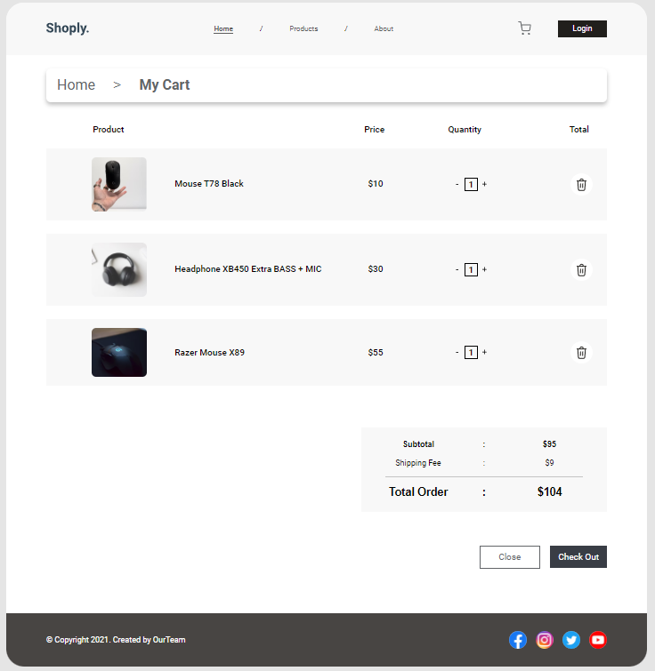
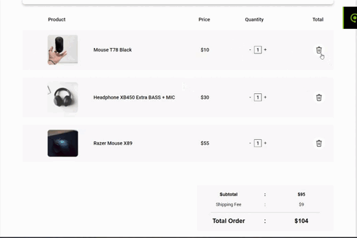
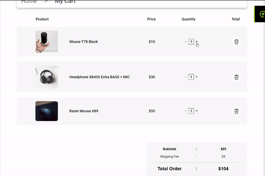

<h1 align="center">Shoply React</h1>

## Описание

Корзина магазина компьютерной техники. Демо временно недоступно.

## О проекте

- Стиль страницы сверстан с помощью SCSS, CSS flexbox, CSS Grid.
- Удаление товаров, изменение количества товаров и перерасчет стоимости в зависимости от количества товара с учетом комиссии реализованы через библиотеку React JS.

- При разработке использовались хуки useState и useEffect.

- Использован шрифт Roboto с Google Fonts.

## Развитие

Добавление новых функций и страниц проекта.

### Спасибо за внимание
